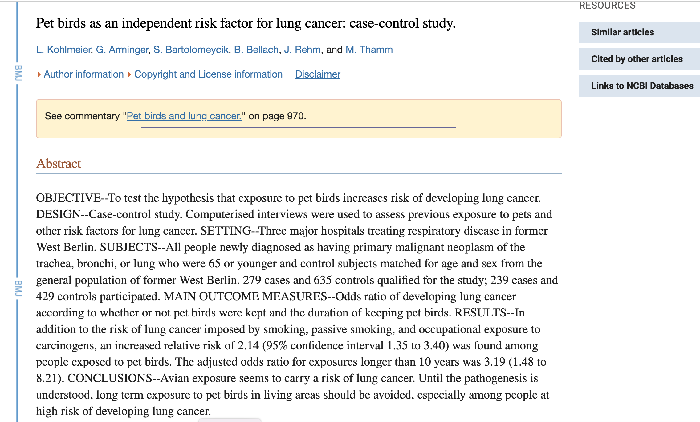

```{r setup, include=FALSE}
knitr::opts_chunk$set(echo = TRUE)
```

## Cancer and bird keeping

   A 1972-1981 health survey in The Hague, Netherlands, discovered an association between keeping pet birds and increased risk of lung
cancer.  To investigate birdkeeping as a risk factor, researchers
conducted a _case-control_ study of patients in 1985 at four
hospitals in The Hague (population 450,000).  They identified 49
cases of lung cancer among the patients who were registered with a
general practice, who were age 65 or younger and who had resided
in the city since 1965.  They also selected 98 controls from a
population of residents having the same general age structure.

Format:

     A data frame with 147 observations on the following 7 variables.

     LC Whether subject has lung cancer

     FM Sex of subject

     SS Socioeconomic status, determined by occupation of the
          household's principal wage earner

     BK Indicator for birdkeeping (caged birds in the home for more
          that 6 consecutive months from 5 to 14 years before diagnosis
          (cases) or examination (control))

     AG Age of subject (in years)

     YR Years of smoking prior to diagnosis or examination

     CD Average rate of smoking (in cigarettes per day)

Source:

     Ramsey, F.L. and Schafer, D.W. (2013). _The Statistical Sleuth: A
     Course in Methods of Data Analysis (3rd ed)_, Cengage Learning.

References:

     Holst, P.A., Kromhout, D. and Brand, R. (1988).  For Debate: Pet
     Birds as an Independent Risk Factor for Lung Cancer, _British
     Medical Journal_ *297*: 13-21.


```{r load, echo=TRUE}
load("case2002.rda")
str(case2002)
```
```{r modelfit}       
     ## EXPLORATION AND MODEL BUILDING
     myCode <- ifelse(case2002$BK=="Bird" & case2002$LC=="LungCancer","Bird & Cancer", 
       ifelse(case2002$BK=="Bird" & case2002$LC=="NoCancer","Bird & No Cancer",
       ifelse(case2002$BK=="NoBird" & case2002$LC=="LungCancer","No Bird & Cancer", "No Bird & No Cancer")))
     table(myCode)
     if(require(car)){   # Use the car library
     scatterplotMatrix(case2002[,c("AG","YR","CD")], groups=myCode, diagonal=FALSE,regLine=FALSE, legend=list(position="bottomleft"),
       pch=c(15,21,15,21), col=c("dark green","dark green","purple","purple"),
      var.labels=c("","YR","CD")) ##cex=1.5) 
     }
 
```
 
```{r fixlevs}
     # Reorder the levels so that the model is for log odds of cancer
     case2002$LC <- factor(case2002$LC, levels=c("NoCancer","LungCancer"))    
     myGlm <- glm(LC ~ FM + SS + AG + YR + CD + BK, family=binomial, data=case2002)
     if(require(car)){   # Use the car library
       crPlots(myGlm)  }
     # It appears that there's an effect of Years of Smoking and of Bird Keeping
     # after accounting for other variables; no obvious effects of other variables
```

```{r logreg}    
     # Logistic regression model building using backward elimination (witholding BK)
     myGlm1 <- glm(LC ~ FM + SS + AG + YR + CD, family=binomial, data=case2002)
     summary(myGlm1)
     myGlm2 <- update(myGlm1, ~ . - SS)        
     summary(myGlm2)
     myGlm3 <- update(myGlm2, ~ . - CD)   
     summary(myGlm3)
     myGlm4 <- update(myGlm3, ~ . - FM)   
     summary(myGlm4) # Everything left has a small p-value (retain the intercept)
 
```

```{r}
     
     ## INFERENCE AND INTERPRETATION
     myGlm5 <- update(myGlm4, ~ . + BK, data=case2002)    # Now add bird keeping
     summary(myGlm5)


  ## INFERENCE AND INTERPRETATION
     myGlm5 <- update(myGlm4, ~ . + BK, data=case2002)    # Now add bird keeping
     summary(myGlm5)
     myGlm6 <- update(myGlm5, ~ . + BK:YR + AG:YR, data=case2002) # Try interaction terms
     anova(myGlm6,myGlm5) # Drop-in-deviance = 1.61 on 2 d.f.
     1 - pchisq(1.61,2)    # p-value = .45: no evidence of interaction
     anova(myGlm4,myGlm5)   # Test for bird keeping effect
     (1 - pchisq(12.612,1))/2  # 1-sided p-value: 0.0001916391
      
     case2002$BK <- factor(case2002$BK, levels=c("NoBird", "Bird"))  # Make "no bird" the ref level
     myGlm5b <- glm(LC ~ AG + YR + BK, family=binomial, data=case2002)   
     beta <- myGlm5b$coef  # Extract estimated coefficients
     exp(beta[4])   # 3.961248                
     exp(confint(myGlm5b,4))   # 1.836764 8.900840  
     # Interpretation: The odds of lung cancer for people who kept birds were 
     # estimated to be 4 times the odds of lung cancer for people of similar age, sex, 
     # smoking history, and socio-economic status who didn't keep birds
     # (95% confidence interval for this adjusted odds ratio: 1.8 times to 8.9 times).
     
     # See bestglm library for an alternative variable selection technique. 


```

## And the study replicated...


